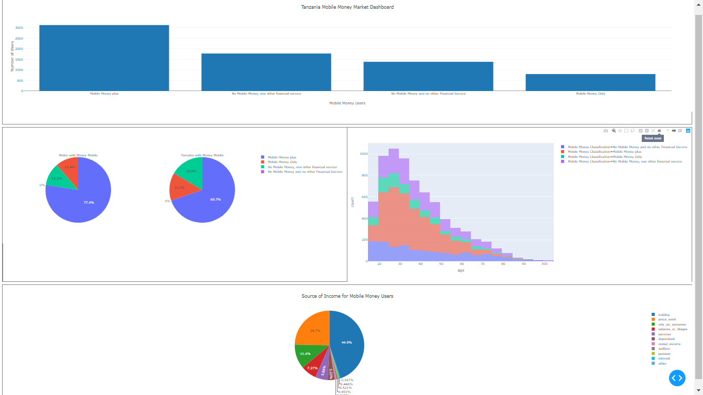

PLOTLY DASHBOARD ASSIGNMENT

Assignment
In the Mobile Money Data Visualisation Assignment, you created graphs to display the relationship 
between the type of financial services accessed (non-mobile, mobile, both), how frequently these 
services were accessed, and socio-demographic information about the users (gender, land ownership 
type of income, and so forth). Create a Plotly dashboard of the 3-5 most informative graphs from this assignment.

Your dashboard should be both visually appealing and informative.

How to run this app?
	
	python app.py
	
	
